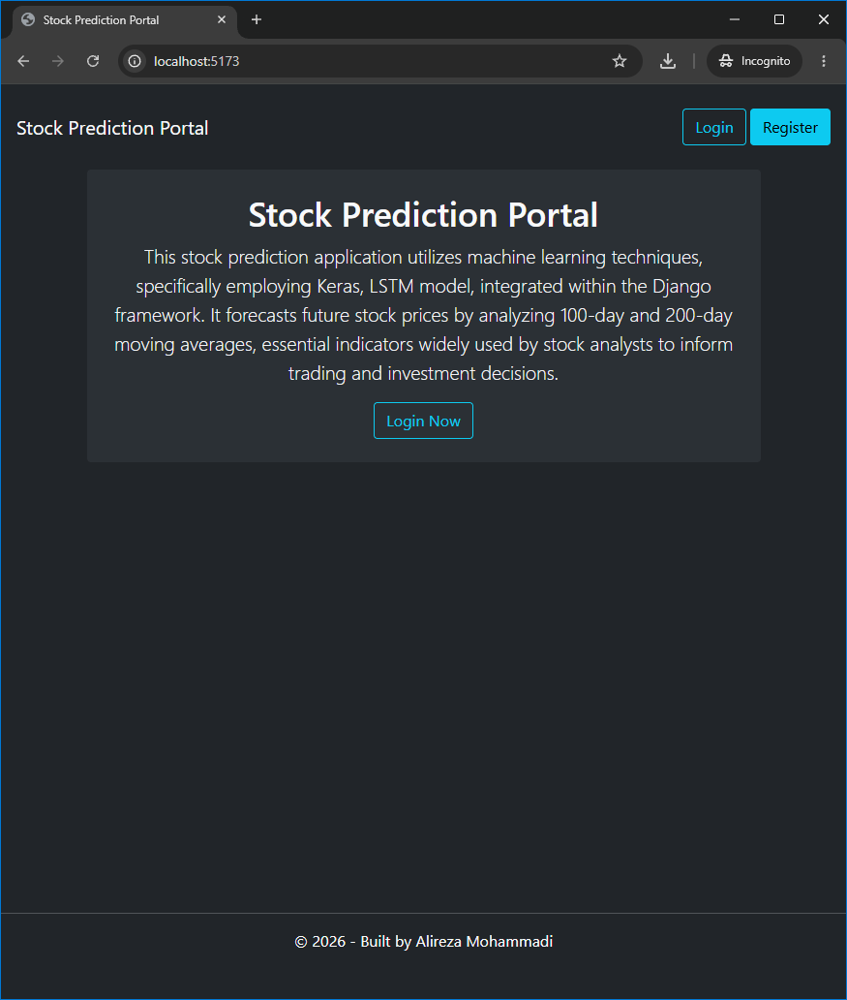
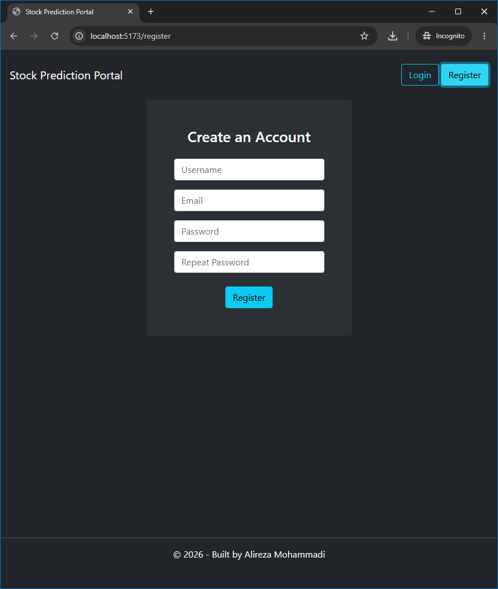
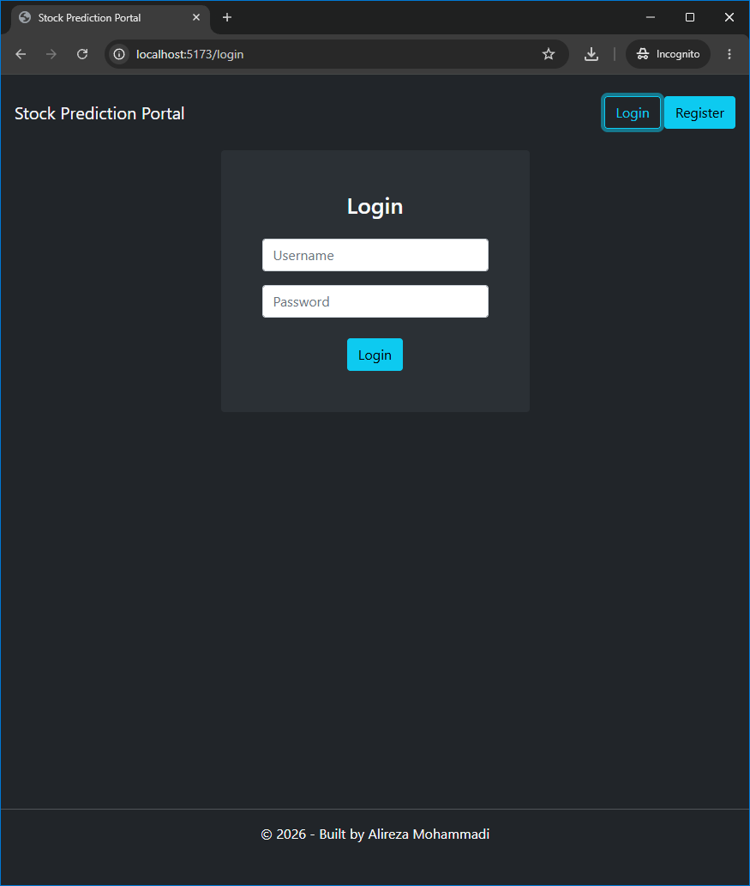
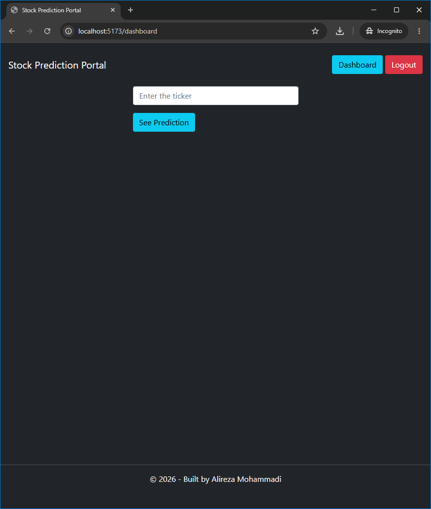
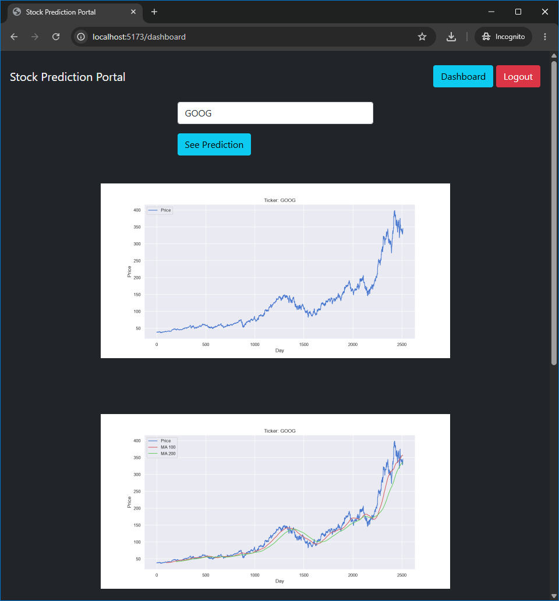
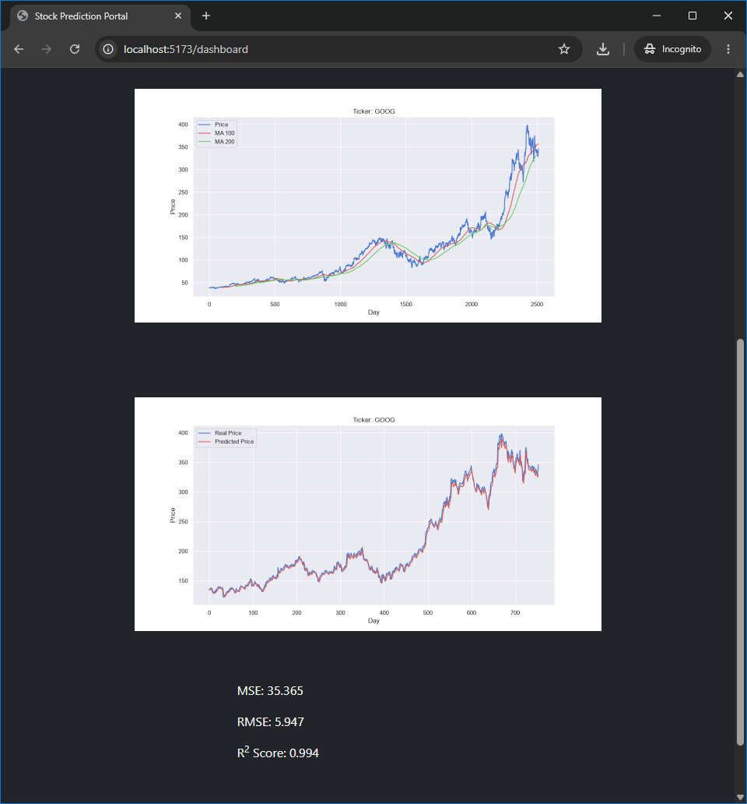
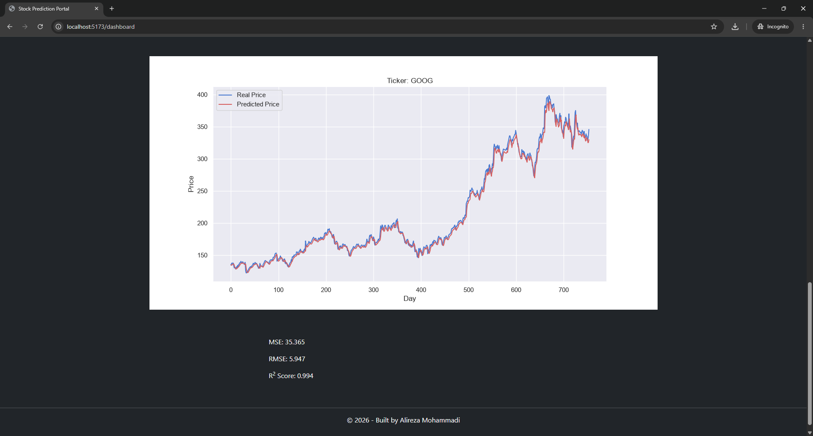

# Stock Prediction Portal

A full-stack financial analytics web application that fetches historical market data from Yahoo Finance and leverages a deep learning LSTM (Long Short-Term Memory) neural network to predict future stock prices.

*Inspired by the [Full Stack Machine Learning Course](https://www.udemy.com/course/full-stack-machine-learning-django-rest-framework-react/) on Udemy.*

---

## Project Overview

<p align="center">
   
   
</p>
<p align="center">
   
   
</p>
<p align="center">
   
   
</p>
<p align="center">
   
</p>

---

## Features

* **Deep Learning Predictions:** Time-series stock price forecasting powered by a trained TensorFlow/Keras LSTM model.
* **JWT Authentication:** Secure user registration, token-based login, and automated session renewal via SimpleJWT and custom Axios event listeners.
* **Multi-Plot Market Analytics:** Generates comprehensive visual analytics including 10-year historical stock trends, 100-day & 200-day Moving Averages (MA), and model predictions overlaid on historical price trends.
* **Protected Client Routing:** Client-side route protection (`PrivateRoute` / `PublicRoute`) powered by React Router and React Context.
* **Modern UI Architecture:** Clean component design built with React 19, Vite, FontAwesome icons, and custom CSS styling.

---

## Tech Stack

* **Frontend:** React 19, React Router v7, Axios, FontAwesome, Vite
* **Backend:** Django, Django REST Framework (DRF)
* **Authentication:** SimpleJWT (JSON Web Tokens)
* **Machine Learning & Data Science:** TensorFlow / Keras (LSTM), NumPy, Pandas, Matplotlib
* **Data Provider:** Yahoo Finance (`yfinance`)

---

## Client Application Routes

| Path | Route Type | Description |
| :--- | :---: | :--- |
| `/` | Public | Landing page with project overview |
| `/login` | Public Only | User login page (redirects if authenticated) |
| `/register` | Public Only | User registration page (redirects if authenticated) |
| `/dashboard` | Protected | Interactive stock prediction dashboard & analytics |

---

## API Endpoints Reference

### Authentication (JWT)

| Endpoint | Method | Description |
| :--- | :---: | :--- |
| `/api/v1/auth/register/` | `POST` | Register a new user account |
| `/api/v1/auth/token/` | `POST` | Authenticate credentials and receive JWT Access/Refresh tokens |
| `/api/v1/auth/token/refresh/` | `POST` | Refresh an expired JWT access token |

### Stock Predictions & Analytics

| Endpoint | Method | Description |
| :--- | :---: | :--- |
| `/api/v1/predict/` | `POST` | Accepts stock symbol payload and returns 10-year historical plots, 100/200-day Moving Averages, and LSTM prediction overlay plots |

---

## Getting Started

### Prerequisites
* **Node.js** (v20.19.0+) & **npm**
* **Python** 3.12+
* **Git**

### Installation & Setup

1. **Clone the repository:**
   ```bash
   git clone https://github.com/Alireza3044/stock-prediction-portal.git
   cd stock-prediction-portal
   ```

2. **Backend Setup:**
   ```bash
   cd backend
   pip install -r requirements.txt
   ```
   Create a `.env` file inside the `backend/` directory:
   ```env
   SECRET_KEY=your-secret-key
   DEBUG=True
   ```
   > **Note:** To generate a secure `SECRET_KEY`, run:
   > `python -c "from django.core.management.utils import get_random_secret_key; print(get_random_secret_key())"`

   Apply database migrations:
   ```bash
   python manage.py migrate
   ```

3. **Frontend Setup:**
   Open a new terminal tab and navigate to the `frontend/` directory:
   ```bash
   cd frontend
   npm install
   ```
   Create a `.env` file inside the `frontend/` directory:
   ```env
   VITE_BACKEND_ROOT_URL=http://localhost:8000/
   VITE_BACKEND_API_URL=http://localhost:8000/api/v1/
   ```

---

## Running the Application

To run the full-stack portal locally, start both development servers:

1. **Start the Backend Server:**
   ```bash
   cd backend
   python manage.py runserver
   ```

2. **Start the Frontend Development Server:**
   ```bash
   cd frontend
   npm run dev
   ```
